# CIVICFIX 311 - PROJECT DIAGRAMS

This file contains all diagrams for the BTech Project Report in multiple formats:
1. **Mermaid Code** - Can be rendered at https://mermaid.live/ or in VS Code with Mermaid extension
2. **ASCII Art** - For quick reference
3. **Draw.io Instructions** - For creating professional diagrams

---

## FIGURE 4.1: SYSTEM ARCHITECTURE DIAGRAM

### Mermaid Code:

```mermaid
graph TB
    subgraph "CLIENT TIER"
        A[Desktop Browser]
        B[Mobile Browser]
        C[Tablet Browser]
    end
    
    subgraph "PRESENTATION LAYER"
        D[React Application<br/>Components, Routing, State]
    end
    
    A --> D
    B --> D
    C --> D
    
    D -->|HTTPS/JSON REST API| E
    
    subgraph "APPLICATION TIER"
        E[Nginx Reverse Proxy]
        F[Gunicorn WSGI Server]
        G[Django Application]
        H[Django REST Framework]
        I[Django Apps:<br/>Users | Complaints<br/>Notifications | Analytics]
    end
    
    E --> F
    F --> G
    G --> H
    H --> I
    
    I -->|SQL Queries via ORM| J
    
    subgraph "DATA TIER"
        J[PostgreSQL Database]
        K[Tables:<br/>Users | Complaints<br/>Categories | Departments<br/>Upvotes | Notifications]
    end
    
    J --> K
    
    style D fill:#e1f5ff
    style I fill:#fff4e1
    style K fill:#e8f5e9
```

### Draw.io Instructions:
1. Create 3 horizontal swim lanes labeled "Client Tier", "Application Tier", "Data Tier"
2. **Client Tier:** Add 3 rectangles for Desktop/Mobile/Tablet browsers → all connect to React box below
3. **Application Tier:** Stack vertically: Nginx → Gunicorn → Django → DRF → Apps (4 boxes side by side)
4. **Data Tier:** PostgreSQL cylinder with table list inside
5. Use arrows: Client→React (HTTP), React→Nginx (REST API/JSON), Apps→DB (SQL)
6. Color code: Client (blue), Application (orange), Data (green)

---

## FIGURE 4.2: THREE-TIER ARCHITECTURE

### ASCII Diagram:

```
┌────────────────────────────────────────────────────────┐
│                   PRESENTATION TIER                    │
│  ┌──────────────────────────────────────────────────┐  │
│  │          React Single Page Application           │  │
│  │  • Components (Pages, Shared, Forms)             │  │
│  │  • React Router (Client-side routing)            │  │
│  │  • State Management (Context API)                │  │
│  │  • Styling (Tailwind CSS)                        │  │
│  │  • Maps (Leaflet), Charts (Recharts)             │  │
│  └──────────────────────────────────────────────────┘  │
└────────────────────────┬───────────────────────────────┘
                         │
              REST API (HTTP/JSON + JWT)
                         │
┌────────────────────────▼───────────────────────────────┐
│                   APPLICATION TIER                     │
│  ┌──────────────────────────────────────────────────┐  │
│  │           Django REST Framework API               │  │
│  │  ┌────────────────────────────────────────────┐  │  │
│  │  │  Authentication & Authorization (JWT)      │  │  │
│  │  └────────────────────────────────────────────┘  │  │
│  │  ┌───────┬──────────┬──────────┬──────────────┐  │  │
│  │  │ Users │Complaints│Notifica- │  Analytics   │  │  │
│  │  │  App  │   App    │tions App │     App      │  │  │
│  │  └───────┴──────────┴──────────┴──────────────┘  │  │
│  │  • Business Logic  • Validation  • Permissions   │  │
│  └──────────────────────────────────────────────────┘  │
└────────────────────────┬───────────────────────────────┘
                         │
                   SQL Queries (ORM)
                         │
┌────────────────────────▼───────────────────────────────┐
│                      DATA TIER                         │
│  ┌──────────────────────────────────────────────────┐  │
│  │            PostgreSQL RDBMS                       │  │
│  │  ┌────────────────────────────────────────────┐  │  │
│  │  │  Tables:                                   │  │  │
│  │  │  • users_user (Auth, Roles, Profiles)      │  │  │
│  │  │  • complaints_complaint (Issues)           │  │  │
│  │  │  • complaints_category (Types)             │  │  │
│  │  │  • complaints_department (Depts)           │  │  │
│  │  │  • complaints_upvote (Votes)               │  │  │
│  │  │  • complaints_statushistory (Audit)        │  │  │
│  │  │  • notifications_notification (Alerts)     │  │  │
│  │  └────────────────────────────────────────────┘  │  │
│  │  • ACID Transactions  • Indexes  • Constraints   │  │
│  └──────────────────────────────────────────────────┘  │
└────────────────────────────────────────────────────────┘
```

---

## FIGURE 4.3: ENTITY-RELATIONSHIP DIAGRAM

### Mermaid Code:

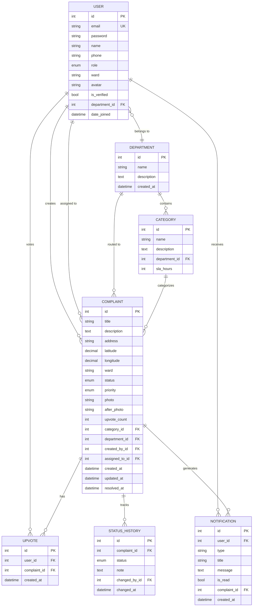

### Detailed ER Diagram for Draw.io:

**Entities (Rectangles):**
1. **USER** - Primary Key: id, Attributes: email (UK), password, name, phone, role, ward, avatar, department_id (FK)
2. **DEPARTMENT** - PK: id, Attributes: name, description
3. **CATEGORY** - PK: id, Attributes: name, description, department_id (FK), sla_hours
4. **COMPLAINT** - PK: id, Attributes: title, description, address, lat/lng, ward, status, priority, photo, category_id (FK), department_id (FK), created_by_id (FK), assigned_to_id (FK)
5. **UPVOTE** - PK: id, Attributes: user_id (FK), complaint_id (FK), created_at
6. **STATUS_HISTORY** - PK: id, Attributes: complaint_id (FK), status, note, changed_by_id (FK)
7. **NOTIFICATION** - PK: id, Attributes: user_id (FK), type, title, message, is_read, complaint_id (FK)

**Relationships (Diamond shapes or lines):**
- USER → COMPLAINT (1:N) "creates" via created_by_id
- USER → COMPLAINT (1:N) "assigned to" via assigned_to_id
- USER → DEPARTMENT (N:1) "belongs to"
- USER → UPVOTE (1:N) "votes"
- USER → NOTIFICATION (1:N) "receives"
- DEPARTMENT → CATEGORY (1:N) "contains"
- DEPARTMENT → COMPLAINT (1:N) "routed to"
- CATEGORY → COMPLAINT (1:N) "categorizes"
- COMPLAINT → UPVOTE (1:N) "has"
- COMPLAINT → STATUS_HISTORY (1:N) "tracks"
- COMPLAINT → NOTIFICATION (1:N) "generates"

**Cardinality:**
- 1:N (one-to-many) - Use crow's foot notation
- N:1 (many-to-one) - Reverse crow's foot
- Unique constraint on (user_id, complaint_id) in UPVOTE table

---

## FIGURE 4.5: USE CASE DIAGRAM - CITIZEN

### Mermaid Code:

```mermaid
graph TD
    CITIZEN([Citizen])
    
    CITIZEN --> UC1[Register Account]
    CITIZEN --> UC2[Login]
    CITIZEN --> UC3[View Profile]
    CITIZEN --> UC4[Submit Complaint]
    CITIZEN --> UC5[View All Complaints]
    CITIZEN --> UC6[Search Complaints]
    CITIZEN --> UC7[Filter Complaints]
    CITIZEN --> UC8[View Complaint Details]
    CITIZEN --> UC9[Upvote Complaint]
    CITIZEN --> UC10[View Map]
    CITIZEN --> UC11[Track Status]
    CITIZEN --> UC12[Confirm Resolution]
    CITIZEN --> UC13[Rate Service]
    CITIZEN --> UC14[View Notifications]
    CITIZEN --> UC15[Change Password]
    
    UC4 -.includes.-> UC16[Upload Photo]
    UC4 -.includes.-> UC17[Select Location]
    UC4 -.includes.-> UC18[Choose Category]
    
    UC10 -.includes.-> UC19[View Markers]
    UC10 -.includes.-> UC20[Filter by Ward]
    
    style CITIZEN fill:#4a90e2,stroke:#333,stroke-width:3px,color:#fff
    style UC4 fill:#f39c12
    style UC9 fill:#f39c12
    style UC12 fill:#f39c12
```

### ASCII Diagram:

```
                          ┌─────────────┐
                          │   CITIZEN   │
                          └──────┬──────┘
                                 │
        ┌────────────────────────┼────────────────────────┐
        │                        │                        │
   ┌────▼────┐             ┌─────▼─────┐           ┌─────▼─────┐
   │Register │             │   Login   │           │   View    │
   │ Account │             │           │           │  Profile  │
   └─────────┘             └───────────┘           └───────────┘
                                 │
        ┌────────────────────────┼────────────────────────┐
        │                        │                        │
   ┌────▼────┐             ┌─────▼─────┐           ┌─────▼─────┐
   │ Submit  │             │   View    │           │  Search/  │
   │Complaint│◄──includes──┤ All       │           │  Filter   │
   │         │   • Photo   │Complaints │           │Complaints │
   │         │   • GPS     │           │           │           │
   │         │   • Category│           │           │           │
   └─────────┘             └───────────┘           └───────────┘
        │                        │                        │
        │                        ▼                        │
        │                  ┌───────────┐                 │
        │                  │   View    │                 │
        │                  │Complaint  │                 │
        │                  │  Detail   │                 │
        │                  └─────┬─────┘                 │
        │                        │                        │
        └────────────────────────┼────────────────────────┘
                                 │
        ┌────────────────────────┼────────────────────────┐
        │                        │                        │
   ┌────▼────┐             ┌─────▼─────┐           ┌─────▼─────┐
   │ Upvote  │             │View Map   │           │  Track    │
   │Complaint│             │ • Markers │           │  Status   │
   │         │             │ • Filters │           │           │
   └─────────┘             └───────────┘           └───────────┘
                                                          │
                                                          ▼
                                                    ┌───────────┐
                                                    │  Confirm  │
                                                    │Resolution │
                                                    │& Rate     │
                                                    └───────────┘
```

---

## FIGURE 4.6: USE CASE DIAGRAM - FIELD OFFICER

### Mermaid Code:

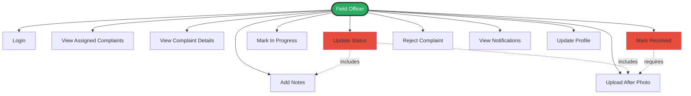

---

## FIGURE 4.7: SEQUENCE DIAGRAM - COMPLAINT SUBMISSION

### Mermaid Code:

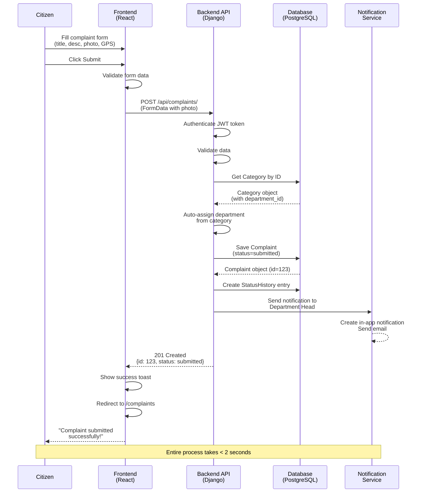

### ASCII Sequence Diagram:

```
Citizen     Frontend      Backend API    Database    Notification
  │             │              │             │              │
  │  Fill Form  │              │             │              │
  ├────────────►│              │             │              │
  │   Submit    │              │             │              │
  ├────────────►│              │             │              │
  │             │ POST /complaints/          │              │
  │             ├─────────────►│             │              │
  │             │              │ Validate    │              │
  │             │              │             │              │
  │             │              │ Get Category│              │
  │             │              ├────────────►│              │
  │             │              │◄────────────┤              │
  │             │              │  category   │              │
  │             │              │             │              │
  │             │              │ Auto-assign │              │
  │             │              │ department  │              │
  │             │              │             │              │
  │             │              │Save Complaint              │
  │             │              ├────────────►│              │
  │             │              │◄────────────┤              │
  │             │              │ complaint   │              │
  │             │              │  (id=123)   │              │
  │             │              │             │              │
  │             │              │Send Notification           │
  │             │              ├────────────────────────────►│
  │             │              │             │    Email +   │
  │             │              │             │    In-app    │
  │             │◄─────────────┤             │              │
  │◄────────────┤ 201 Created  │             │              │
  │  Success!   │ {id: 123}    │             │              │
  │             │              │             │              │
```

---

## FIGURE 4.8: SEQUENCE DIAGRAM - STATUS UPDATE

### Mermaid Code:

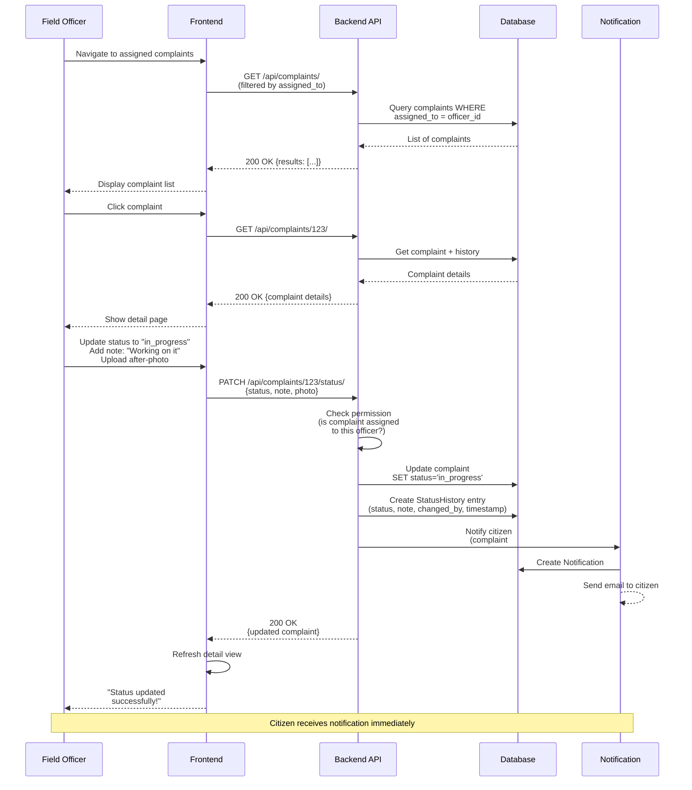

---

## FIGURE 4.9: DATA FLOW DIAGRAM - LEVEL 0 (CONTEXT)

### Mermaid Code:

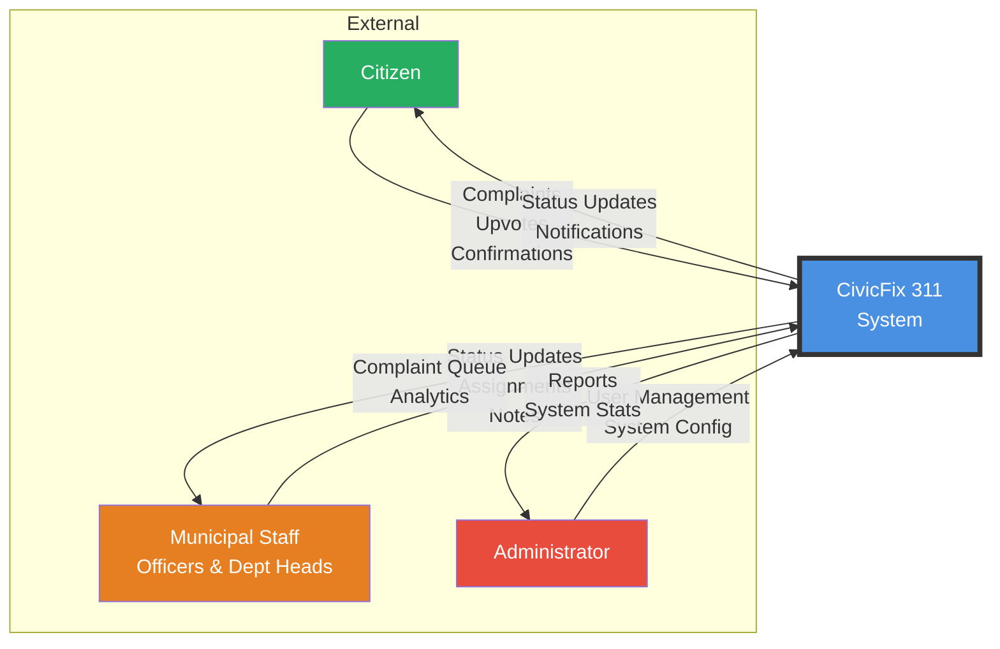

### ASCII DFD Level 0:

```
                    ┌──────────────────────────┐
                    │                          │
    ┌──────────┐    │                          │    ┌──────────┐
    │          │───►│                          │◄───│          │
    │ Citizen  │    │    CivicFix 311         │    │Municipal │
    │          │◄───│       System            │───►│  Staff   │
    └──────────┘    │                          │    └──────────┘
                    │  (All Processing &       │
    Complaints,     │   Data Management)       │    Status Updates,
    Upvotes,        │                          │    Analytics,
    Confirmations   │                          │    Assignments
                    │                          │
                    │                          │    ┌──────────┐
                    │                          │◄───│          │
                    │                          │    │  Admin   │
                    │                          │───►│          │
                    └──────────────────────────┘    └──────────┘
                                                    
                                                    User Mgmt,
                                                    Reports,
                                                    System Config
```

---

## FIGURE 4.10: DATA FLOW DIAGRAM - LEVEL 1

### Mermaid Code:

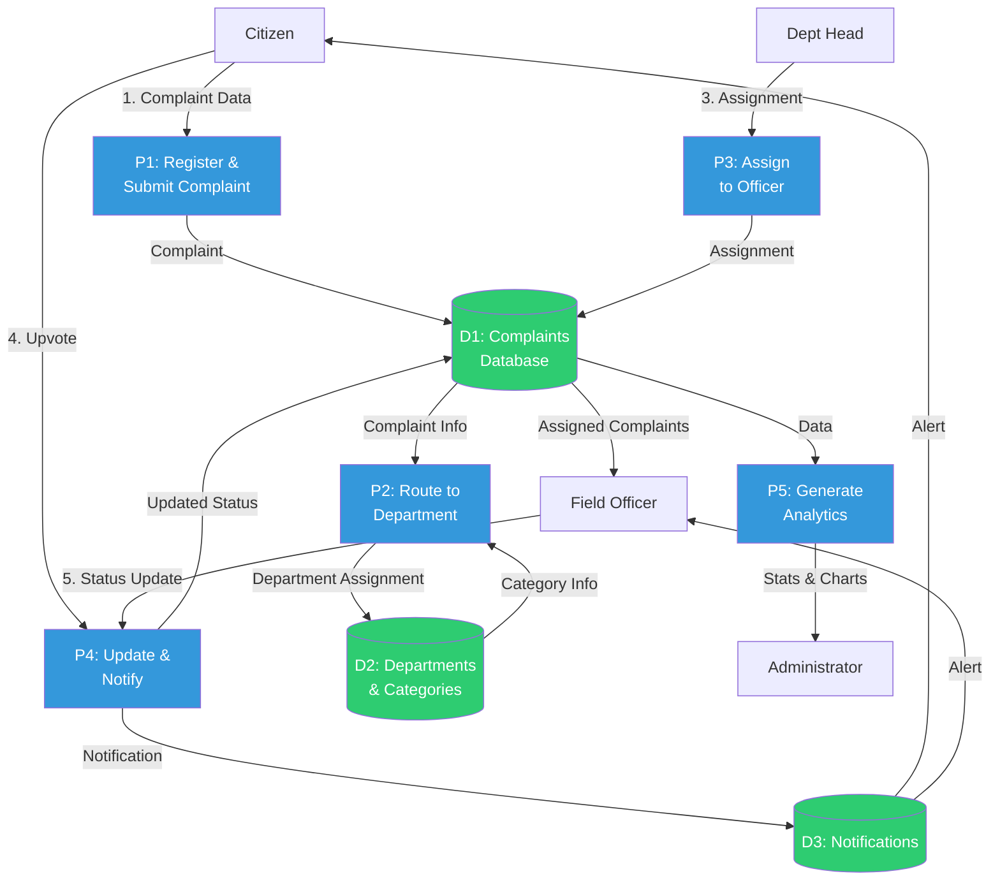

---

## FIGURE 5.1: TECHNOLOGY STACK OVERVIEW

### ASCII Diagram:

```
┌─────────────────────────────────────────────────────────────┐
│                      FRONTEND STACK                         │
├─────────────────────────────────────────────────────────────┤
│  React 18          │  Component-based UI library            │
│  React Router 6    │  Client-side routing                   │
│  Tailwind CSS 3    │  Utility-first styling                 │
│  Axios             │  HTTP client for API calls             │
│  Leaflet           │  Interactive maps                      │
│  Recharts          │  Data visualization charts             │
│  React Hot Toast   │  Notification toasts                   │
└─────────────────────────────────────────────────────────────┘
                              │
                              │ REST API
                              │ (HTTPS/JSON)
                              ▼
┌─────────────────────────────────────────────────────────────┐
│                      BACKEND STACK                          │
├─────────────────────────────────────────────────────────────┤
│  Django 6.0        │  Web application framework             │
│  DRF 3.16          │  RESTful API toolkit                   │
│  SimpleJWT 5.3     │  JWT authentication                    │
│  Gunicorn          │  WSGI HTTP server                      │
│  WhiteNoise        │  Static file serving                   │
│  django-cors       │  CORS headers handling                 │
│  django-filters    │  Queryset filtering                    │
└─────────────────────────────────────────────────────────────┘
                              │
                              │ SQL (ORM)
                              ▼
┌─────────────────────────────────────────────────────────────┐
│                      DATABASE                               │
├─────────────────────────────────────────────────────────────┤
│  PostgreSQL 14     │  Relational database                   │
│                    │  ACID transactions                     │
│                    │  Indexed queries                       │
│                    │  Foreign key constraints               │
└─────────────────────────────────────────────────────────────┘

┌─────────────────────────────────────────────────────────────┐
│                    DEPLOYMENT STACK                         │
├─────────────────────────────────────────────────────────────┤
│  Docker            │  Application containerization          │
│  Docker Compose    │  Multi-container orchestration         │
│  Nginx             │  Reverse proxy & static serving        │
│  Git               │  Version control                       │
└─────────────────────────────────────────────────────────────┘
```

---

## FIGURE 5.4: SYSTEM INTEGRATION FLOW

### Mermaid Code:

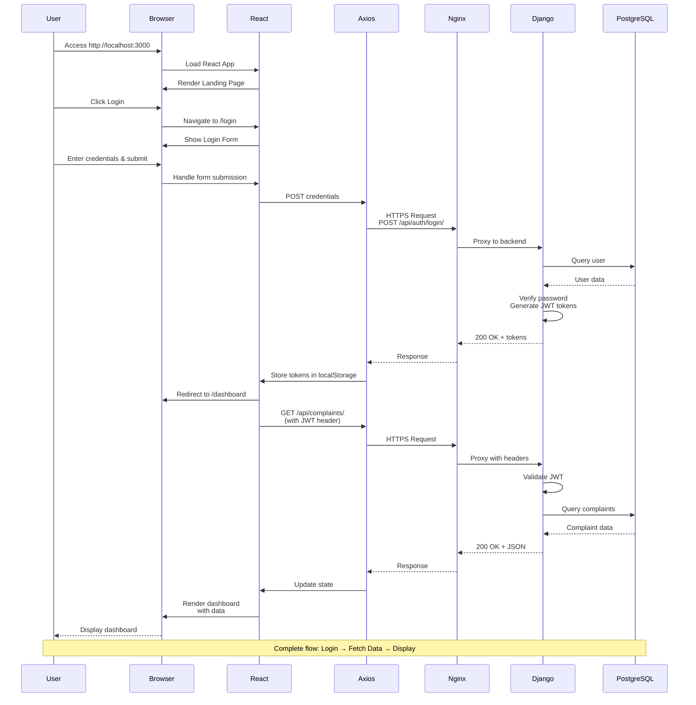

---

## FIGURE 5.5-5.11: SCREENSHOT PLACEHOLDERS

### Instructions for Screenshots:

**Figure 5.5: Landing Page**
- Capture full-page screenshot at 1920x1080
- Show hero section with "CivicFix 311" branding
- Include "How It Works" section
- Annotate: Navigation menu, CTA buttons, Features section

**Figure 5.6: Login Page**
- Split-panel layout
- Left: Illustration/graphic
- Right: Login form with email/password fields
- Highlight "Demo credentials" note if present

**Figure 5.7: Dashboard**
- Summary statistics cards (4 cards showing Total, Pending, In Progress, Resolved)
- Trend line chart (30 days)
- Recent complaints table
- Annotate: "Summary Stats", "Trend Chart", "Recent Complaints"

**Figure 5.8: Complaint List**
- Table view with columns: ID, Title, Status, Priority, Upvotes, Date
- Show filters: Status dropdown, Ward dropdown, Search box
- Pagination controls at bottom
- Highlight one row to show clickable nature

**Figure 5.9: New Complaint Form**
- Multi-field form layout
- Show: Title, Description, Category dropdown, Address, Ward, Photo upload
- GPS coordinates fields
- "Fill Demo" button (if present)
- Submit button at bottom

**Figure 5.10: Map View**
- Full Leaflet map with multiple markers
- Marker cluster visible
- Popup showing complaint details when marker clicked
- Filter sidebar on left
- Legend for marker colors/priorities

**Figure 5.11: Analytics Dashboard**
- Multiple charts:
  - Status distribution pie chart
  - Category bar chart
  - Trend line graph
  - Department performance table
- Date range selector
- Export button (if present)

---

## DEPLOYMENT ARCHITECTURE DIAGRAM

### Mermaid Code:

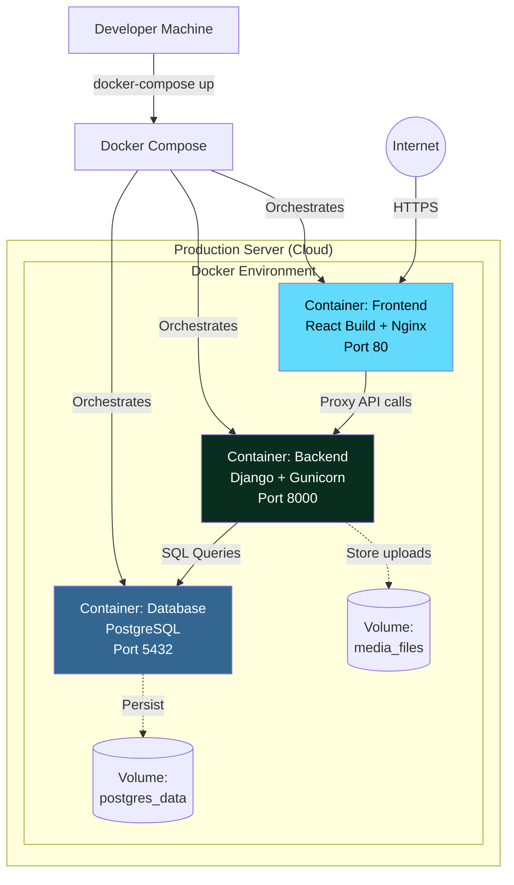

### ASCII Deployment:

```
┌──────────────────────────────────────────────────────────────┐
│              PRODUCTION SERVER (Cloud/VPS)                   │
│                                                              │
│  ┌────────────────────────────────────────────────────────┐ │
│  │           Docker Compose Orchestration                 │ │
│  └────────────────────────────────────────────────────────┘ │
│                          │                                   │
│     ┌────────────────────┼────────────────────┐             │
│     │                    │                    │             │
│  ┌──▼──────────┐  ┌──────▼──────┐  ┌─────────▼────┐        │
│  │  Container  │  │  Container  │  │  Container   │        │
│  │  frontend   │  │  backend    │  │  postgres    │        │
│  ├─────────────┤  ├─────────────┤  ├──────────────┤        │
│  │ Nginx       │  │ Django 6    │  │ PostgreSQL   │        │
│  │ :80         │  │ DRF         │  │ :5432        │        │
│  │             │  │ Gunicorn    │  │              │        │
│  │ React Build │  │ :8000       │  │ Database     │        │
│  │ (Static)    │  │             │  │              │        │
│  └──────┬──────┘  └──────┬──────┘  └──────┬───────┘        │
│         │                │                │                 │
│         │  Proxy /api    │                │                 │
│         └───────────────►│                │                 │
│                          │   SQL Queries  │                 │
│                          └───────────────►│                 │
│                                            │                 │
│  ┌──────────────────┐           ┌─────────▼────────┐        │
│  │ Volume:          │           │ Volume:          │        │
│  │ media_files      │◄──────────┤ postgres_data    │        │
│  │ (uploads)        │           │ (persistent DB)  │        │
│  └──────────────────┘           └──────────────────┘        │
└──────────────────────────────────────────────────────────────┘
                       ▲
                       │
                  HTTPS (443)
                       │
                  ┌────┴────┐
                  │ Internet│
                  │  Users  │
                  └─────────┘
```

---

## AUTHENTICATION FLOW DIAGRAM

### Mermaid Code:

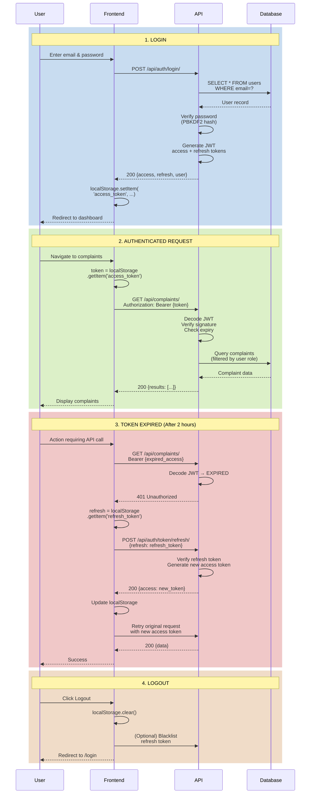

---

## COMPLAINT LIFECYCLE STATE DIAGRAM

### Mermaid Code:

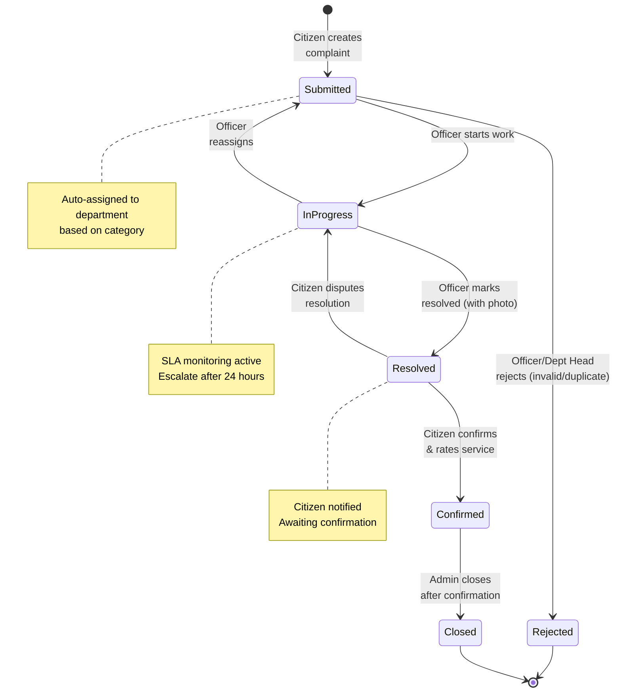

---

## USER ROLE HIERARCHY

### ASCII Diagram:

```
                    ┌──────────────────┐
                    │  ADMINISTRATOR   │
                    │                  │
                    │  • Full access   │
                    │  • User mgmt     │
                    │  • All analytics │
                    └────────┬─────────┘
                             │
              ┌──────────────┴──────────────┐
              │                             │
      ┌───────▼────────┐          ┌─────────▼────────┐
      │ DEPARTMENT HEAD │          │      CITIZEN     │
      │                 │          │                  │
      │ • Dept analytics│          │ • Submit issues  │
      │ • Assign to     │          │ • View all       │
      │   officers      │          │ • Upvote         │
      │ • Monitor SLA   │          │ • Track own      │
      └────────┬────────┘          └──────────────────┘
               │
       ┌───────▼────────┐
       │ FIELD OFFICER  │
       │                │
       │ • View assigned│
       │ • Update status│
       │ • Upload photos│
       │ • Add notes    │
       └────────────────┘

Access Control Matrix:

Feature              │ Citizen │ Officer │ Dept Head │ Admin │
─────────────────────┼─────────┼─────────┼───────────┼───────┤
Submit Complaint     │    ✓    │    ✗    │     ✗     │   ✗   │
View All Complaints  │    ✓    │    ✗    │     ✗     │   ✓   │
View Assigned        │    ✗    │    ✓    │     ✗     │   ✗   │
Update Status        │    ✗    │    ✓    │     ✓     │   ✓   │
Assign to Officer    │    ✗    │    ✗    │     ✓     │   ✓   │
Upvote Complaint     │    ✓    │    ✗    │     ✗     │   ✗   │
View Analytics       │    ✗    │    ✗    │     ✓     │   ✓   │
Manage Users         │    ✗    │    ✗    │     ✗     │   ✓   │
```

---

## HOW TO USE THESE DIAGRAMS

### Option 1: Render Mermaid Diagrams
1. Go to https://mermaid.live/
2. Paste the Mermaid code
3. Export as PNG or SVG
4. Insert image in Word document

### Option 2: Draw.io (Recommended for Professional Look)
1. Download Draw.io Desktop or use https://app.diagrams.net/
2. Follow the detailed instructions provided for each diagram
3. Use shapes: Rectangles (processes), Cylinders (databases), Diamonds (decisions), Actors (stick figures)
4. Export as PNG (300 DPI for print quality)
5. Insert in Word document

### Option 3: Microsoft Visio
1. Use Visio if available
2. Follow similar structure as Draw.io instructions
3. Use UML templates for ER diagrams and Use Cases
4. Use flowchart templates for DFDs

### Option 4: PowerPoint
1. Use SmartArt and shapes in PowerPoint
2. Create diagrams based on ASCII layouts
3. Export slides as images
4. Insert in Word

---

## DIAGRAM CHECKLIST FOR REPORT

- [ ] Figure 4.1: System Architecture Diagram
- [ ] Figure 4.2: Three-Tier Architecture
- [ ] Figure 4.3: Entity-Relationship Diagram
- [ ] Figure 4.4: Database Schema (use ER diagram + table list)
- [ ] Figure 4.5: Use Case Diagram - Citizen
- [ ] Figure 4.6: Use Case Diagram - Field Officer
- [ ] Figure 4.7: Sequence Diagram - Complaint Submission
- [ ] Figure 4.8: Sequence Diagram - Status Update
- [ ] Figure 4.9: Data Flow Diagram Level 0
- [ ] Figure 4.10: Data Flow Diagram Level 1
- [ ] Figure 4.11: UI Wireframe - Landing Page (screenshot)
- [ ] Figure 4.12: UI Wireframe - Dashboard (screenshot)
- [ ] Figure 5.1: Technology Stack Overview
- [ ] Figure 5.4: System Integration Flow
- [ ] Figures 5.5-5.11: Application Screenshots

---

All diagrams designed for CivicFix 311 BTech Project Report
Created: April 2026
